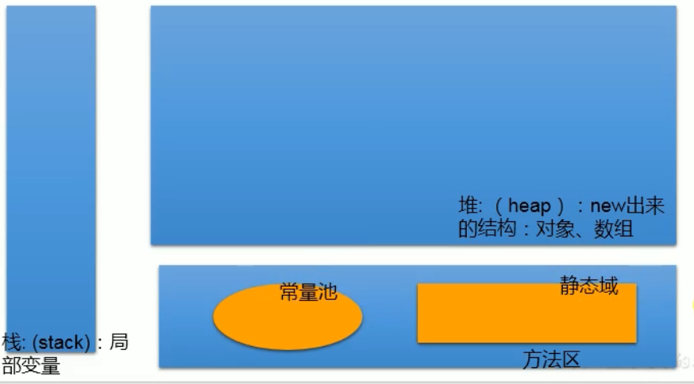
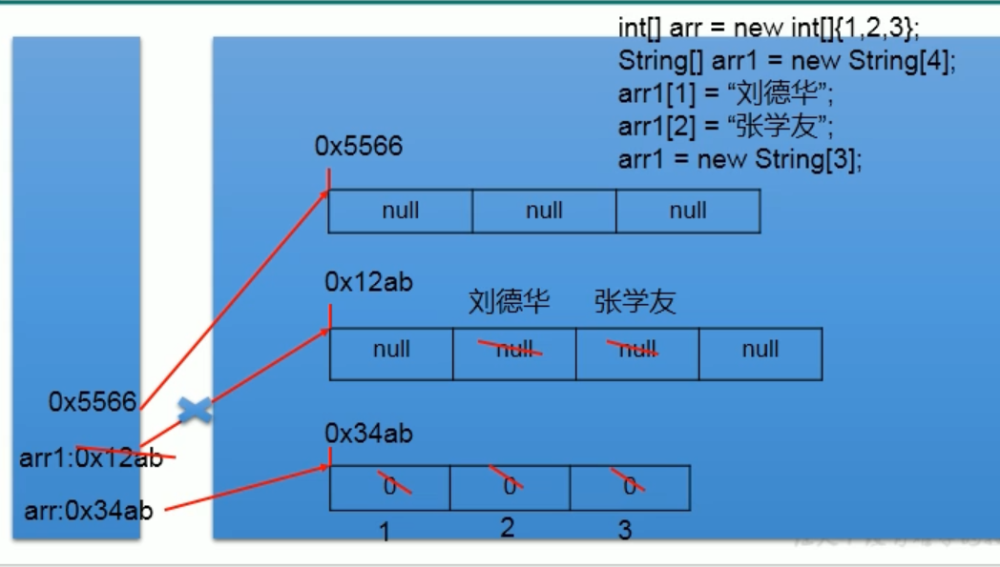
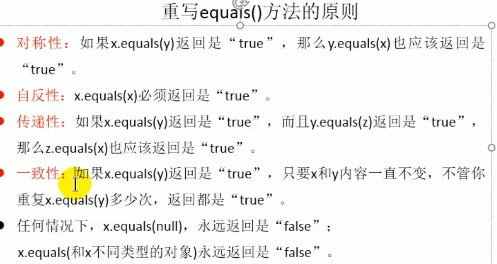

# **Java学习总结笔记**

***Author：liuzidi***

***Location：ZheJiang University***


## 一.Java工具IDEA的使用

### 1.1 IDEA的使用

安装和卸载；

设置快捷键；

设置背景和其他设置；

## 二. Java基础学习

## 2.1 计算机基础介绍

### 2.1.1 计算机组成原理

冯诺依曼体系结构：输入设备-存储器-输出设备（CPU（运算器和控制器））；

CPU：控制单元和算术/逻辑单元；

IT三大定律：摩尔/反摩尔定律，安迪-比尔定律；

内存断电时数据会丢失；（内存读取比从存储读取快得多）；

1 Byte =8 bits ,bit存储0和1是最小的存储单元，byte是存储数据最小单位；

（操作流程）CPU-内存-硬盘，内存相当于高速通道；

输入输出设备：鼠标键盘；通信设备；

图灵：计算机之父 人工智能之父；冯诺依曼：计算机之父 博弈论之父；

### 2.1.2 操作系统

硬件-操作系统-应用程序-用户；

### 2.1.3 计算机网络

World Wide Web（万维网）；

通过//http协议（超文本传输协议）交流；

万维网-因特网-互联网（包含关系）；

## 2.2 Java基础

### 2.2.1  Java概述

JavaEE，大数据，Android开发；

Spring框架（JAVAEE）；Spark框架（scala安卓开发）；

### 2.2.2 Java基础知识

#### 2.2.2.1 编程语言介绍

语言：机器语言-汇编语言-高级语言：

C：面向过程

C++面向过程/对象

Java 跨平台的纯面向对象的语言

.NET跨语言的平台

开发难度：C＞Java＞Python

运行效率：C< Java < Python

Objective C:苹果的开发应用

#### 2.2.2.2 Java历史

SUN公司1995年推出的一门高级编程语言

针对C缺少垃圾回收系统；

Java：Oak：家电

面向Web和Internet的编程语言（后台开发）

后台开发：Java，PHP，Python，Go，Node.js

前端和后端：服务员和厨师的关系；

JDK：Java环境；里程碑式的版本：JDK 5.0，JDK8.0是5以后变化最大的版本

2018年3月：JDK10.0版本号也叫JDK18.3；

#### 2.2.2.3 Java体系平台


JavaME和Java Card现在已经合并；（MP3等小型设备已经被淘汰）


（Java的指针封装得很好，原理本质还是寻址指针）

#### 2.2.2.4 Java的特点

面向对象，健壮性，跨平台性（原理：安装虚拟机JVM：Java Virtual Machine）


#### 2.2.2.5 Java的环境

##### 2.2.2.4.1 JDK

JDK（Java Development Kit）Java开发工具包：包括JRE，（因此安装JDK后不用再安装JRE了），开发必须

​	包含编译工具；打包工具；

​	JDK=JRE+开发工具集(编译工具)

##### 2.2.2.4.2 JRE

JRE（Java Runtime Environment）：Java运行环境，运行“Java文件只需JRE即可

​	包含 Java虚拟机和核心类库；

​	JRE=JVM+Java SE标准类库；	


#### 2.2.2.6 Java的程序运行


javac运行代码txt后形成字节码文件，再用java进行运行；


总结：java文件可以声明多个类，但只能有一个public；

public只能加到和文件名同名的文件中；

即程序名就是类方法；

```java
class helloworld{
    public static void main(String[] args){
        System.out.println("Hello World1");
    }
}
```


#### 2.2.2.7 Java的注释

单行注释//，多行注释： /*/

文档注释（java特有的注释方法）

格式:

```java
/**
文档注释:
@author:
@version:
*/
```

然后再cmd中代码目录中javadoc -d 文件名 -version 注释文档名.Java

#### 2.2.2.8 Java API文档


API文档：相当于Java说明书

下载网址：http：//www.oracle.com/technetwork/java/javase/downloads/index.html

#### 2.2.2.9 Java 基本语法

##### 2.2.2.9.1 输出

```java
System.out.print();

System.out.println();//换行
```

##### 2.2.2.9.2 关键字


##### 2.2.2.9.3 保留字


##### 2.2.2.9.4 标识符

标识符（Identifier）

变量，方法，类名即标识符；

数字不可以开头

包含_ $ 数字 大小写字母；

##### 2.2.2.9.5 命名方式

驼峰命名法；


包名：全部小写；

类名，接口名：首字母大写驼峰；

变量名，方法名 首字母小写驼峰；

常量名：全部大写用单词间_隔开

##### 2.2.2.9.6 变量

变量类型 变量名 =变量值

定义变量的注意点：

1.变量声明后才能使用（和C差不多）；

2.变量只能定义在作用域内，出了作用域之后无法使用；

变量类型：

基本数据类型：byte int(short long) float double char boolean 

引用数据类型： class  interface    []（数组）

注：byte（1字节）：范围-128-127 ）(8个bit)

short(2字节)：范围：

int（4字节）：范围：

long（6字节）：范围**（定义long需要加l或者L)**

float（4字节）：范围大，精度小（范围比long还大，但是精度无法计算）**（定义float需要加f或者F）**

double（8字节）：范围大，精度大

char（2字节）：转义字符\ : \n:换行 \t:制表符 \u(unicode:字符编码集)

boolean: 只能取true和false两个值之一；（和C++不一样的是不是用整型0和1表示）

**（注：java的变量一般定义为int类型，除非特别大的数才用long，变量名后必须加l或者L）**

基本数据类转换规则

长度长的加上短的用长的来容纳；

byte \ short \ char->int->long->float->double

**byte \ short \ char三种类型做运算时必须用int 容纳**（包括同类型之间的运算）

强制类型转换：类型（变量名） =（强制转换的类型）类型：可能导致精度损失；

```java
class a{
    public static void main (String [] args) {
        byte b= 1;
        byte b1= b+1; //编译错误，因为默认1为int类型
        long l= 132l;//没加l后缀但是仍然编译通过 ，因为系统默认当做了int类型
        long l1 =12312312414132; //编译失败 
        long l2 -1334234234324234L;//编译成功；
    }       
}
```

##### 2.2.2.9.7 String 类型变量

String 类型变量属于引用数据类型；

定义String时用”  “来定义；

可以和八种数据类型进行运算；结果都是String类型；

和数据进行加减乘除的时候 ，直接进行连接运算；

```java
class a {

public static void main (String [] args){
    char c= 'a';
 	int num = 10;
    String str ="b";
    
    System.out.println(c + num +str）; //107b;
    System.out.println(c + str +num);  //ab10;
    System.out.println(c +(num +str)); //a10b;    
    System.out.println((c + num ) +str);//107b;
    System.out.println((str +num) +c);// b10a;
   }
```

**注意：char用单引号，字符串用双引号；**

##### 2.2.2.9.8 运算符

###### 1. 算术运算符

（加减乘除余）

```java
//除法运算
int a = 5;
int b = 12;
double c0 = b/a; //2 
double c1 = b/(a+0.0);//2.4
double c2 = (double)b/a; //2.4
double c3 =(double)(b/a); //2.0

//取余运算
//符号和被除数相同；
 //加法运算 注意点：
short s1=10;
s1= s1+1;//编译失败；1 为int
s1= (short)(s1+1);//成功
s1++;//自增不改变本身变量的数据类型；
```


###### 2. 赋值运算符

= 可以连续赋值

```java
int i1= i2 =3;//可以
```


+=和 普通的还是有区别的；不改变数据类型


练习：


可以通过 结果为0；


结果为32


###### 3. 比较运算符

结果都是 boolean类型（区分好==和=的区别）


**instanceof**


###### 4. 逻辑运算符


短路和逻辑的区别：


当前情况没区别（因为存在前面是false的情况直接pass，短路会pass）


开发中推荐是用短路；

练习：


###### 5. 位运算符

（一般不使用，看的懂就行）


应用1：交换值：


应用2：经典面试题


应用2：手动实现0-255转换为16进制

**

###### 6. 三元运算符


三元运算符可以嵌套


三元运算符与if-else的转换


运算符的优先级：


#### 2.2.2.10 Java 流程控制


 

##### 2.2.2.10.1 分支结构

if-else运算方式


从键盘导入包:采用Scanner类


```java
import java.util.Scanner;
class ScannerTest{
    public static void main{
        Scanner scan = new Scanner(System.in);
        
        int num =scan.nextInt();
        System.out.println(num);//整型的输入
        String  str=scan.next();        
        System.out.println(str);
        double dd =scan.nextDouble();//双精度浮点数的输入
        System.out.println(dd);
        boolean b =scan.nextBoolean();//boole数的输入
        System.out.println(b);
    }
}
```


随机数的产生：

```java
Math.random()          //[0.0,1.0]
    //公式 ：[a,b] :(int)(Math.random()*(b - a + 1 ) + a );
```


swtch-case


switch结构中的表达式中：只能是以下六种数据类型：


**（不允许用boolean类型）**

case不允许有范围，即不能是boolean类型

switch-case 和if-else的选择情况：


##### 2.2.2.10.2 循环结构

过程图示：


for循环


初始化和迭代条件可以很灵活“


while循环：


切记：循环过程注意别漏了迭代条件，否则会陷入死循环

for循环和while循环可以互相转换；

小区别：初始条件就是作用域不同而已

while可以用break'跳出循环；

```java
while (true){
    if{}
    else if{}.....
    else{break;}
}
```


do-while循环


do-while循环与其他循环体的小区别：至少会进行一次循环体


总结：跳出循环的方式：

1.循环条件的跳出

2.break；


 嵌套循环：

1.默认规定：一般不超过三层；超出就考虑新方法；

2.内层循环遍历一次，外层循环仅仅循环一次；

3.外循环控制行数，内循环控制列数；

P121：质数输出

数据结构与算法非常重要


使用开方进行优化


break 和continue 关键字的使用


就近原则：跳出最近的循环；

可以指定break的循环体：

```java
A: for(----){
    	for (===)    {
            break A;
        }
}
```

return 结束一个方法；

阶段性项目：

收支明细记录系统


### 2.2.3JavaEE进阶


#### 2.2.3.1 eclipse 

快捷键：

-----

main Alt+/  

sysomain Alt+/ 


----

区分安装目录和workspace

软件存放的位置

安装目录

workspace：代码存放的位置，因此软件卸载后代码仍然存在；

----


#### 2.2.3.2 数组概述

---

概念

----

数组名

下标

元素

数组长度

---

特点

----

1. 有序排列
2. 属于引用数据类型的变量
3. 长度确定后无法改变
4. 内存空间连续


---

一维数组的初始化

---

```java
//声明
int[]ids;
//静态初始化		
int[]ids =new int[] {1,2,3,4};

//动态初始化
int[] ids =new int[5];
       
//也是正确的写法 类型推断
    int[] arr ={1,2,3,4};
```

错误的初始化方式


---

调用数组的指定位置的元素

----

数组的角标是从0开始的，到数组的长度-1结束；


---

获取数组的长度

---

属性：length

```java
ids.length;
```

---

遍历数组

---

用一个循环配合输出进行输出遍历

```java
for(int i=0; i<ids.length; i++){
    System.out.println(a[i]);
}
```

----

数组元素的默认初始化值

---

int/short/long类型的数组默认为0；

float/double默认为0.0；+

char类型默认为：**0或  ‘/u000’** 形式上像个空格（注意不是‘0’）；

Boolean类型默认B为false；

引用数据类型的默认为：null


---

数组的内存解析

---






只要有new字符，就会在堆中开辟新空间，并且在栈中生成一个记录地址的数组（类似指针引用），在初始化数组后如果让他重新开辟，会指向新开辟的堆空间对象，并且会将先前初始化好的堆空间当作垃圾在适当的时候释放；


---

多维数组

---

实质：数组的元素为数组；

---

二维数组的初始化

---


---

二维数组的调用

-----

下标都要相应的减一；

如：

```java
arr[1][2] //指第二行的第三列的元素的调用
```

---

二维数组的长度

---

长度为第一行的长度

因为实质上多维数组就是个嵌套的一维数组；


----

遍历二维数组

---

嵌套for循环

```java
for(int i= 0 ; i<arr.length; i++){
    for (int j= 0 ; j<arr[i].length ; j++){
        arr[i][j]=.....
    }
}
```

---

数组元素的默认初始值

---

规定：二维数组分为外层和内层的元素

初始化方式1：

```java
int [][]arr=new int [4][3];
```

1. 外层：地址值

2. 内层：

   1. int/short/long类型的B数组默认为0；

   2. float/double默认为0.0；

   3. char类型默认为：**0或  ‘/u000’** 形式上像个空格（注意不是‘0’）；

   4. Boolean类型默认为false；

   5. 引用数据类型的默认为：null

      

初始化方式2:

```java
int [][]arr=new int [4][];
```

1. 外层：null
2. 内层：无法调用，否则报错；

-----

二维数组的数据内存解析

---


数据结构:

---

逻辑关系：集合，一对一，一对多，多对多

存储结构：

线性表：顺序表（数组）链表 栈 队列

树形结构：二叉树

图形结构

---

算法：

排序算法

搜索算法

---

各排序算法的时间复杂度对比


---

数组：Array工具类的使用


```java
import java.util.Arrays;
Arrays.equals(a,b);
```

数组中常见异常：

1.越界异常 ArrayIndexOutOfBoundsException

角标不能为负数，不能大于length-1；

2.空指针异常 NullPointerexeption

指针是Null不会报错，但是如果让null的指针进行指向会发生错误

如：

```java
int[][]arr=new int [2][];
sysout(arr[1][]);//输出null，并不构成报错
sysout(arr[1][0]);//NullPointerexeption，空指针不能指向
```

项目 包（某一大类的包） 类

util包：Arrays提供了很多操作数组的方法

import java.util.Arrays

### 2.2.4 Java面向对象

#### 2.2.4.1 Java类及类的成员

---

属性 方法 构造器 代码块 和内部类

属性=成员=域=field

方法=成员函数=Method

对象是引用变量


新建对象

```java
类名 对象名= new 类名();
```

如果创建了一个类的多个对象，则每个对象都拥有一套独立的类的属性

```java
class person{};
person p1 =new person();
person p2 = p1;//p1 p2指向同一块堆空间
```

对象的创建


#### 2.2.4.2 面向对象三大特征

---

封装性 继承性 多态性 抽象性

#### 2.2.4.3 其他关键字

---

```java
this super static final abstract interface package import
```

#### 2.2.4.4 对象的内存解析

---

堆空间（Heap）创建新对象的位置

栈空间（Stack）引用变量，局部变量


#### 2.2.4.5 属性vs局部变量

---

不同点

1.类中的声明的位置不同

2.函数内的变量和调用形参的情形为局部变量

3.声明方法：变量名 = 变量值


相同点：

1.先声明后使用

2.都有其作用域


 关于权限修饰符的不同

1.属性：声明属性时，指明权限 private public 缺省

2.局部变量：无权限修饰符


默认初始化值的情况：（非static）

属性：根据其类型都有默认初始化值


局部变量：没有默认赋值，必须显性赋值

#### 2.2.4.6 Method


 不能在方法中建新的方法

编译完源代码以后，生成一个或多个字节码文件

我们使用JVM的类的加载器和解释器对生成的字节码文件进行解释运行，这就意味着需要将字节码文件对应的类加载到内存中，涉及到内存解析


虚拟机栈：即栈，我们将局部变量存储到栈结构中

堆：new出来的结构（如对象，数组）加载到堆空间中，对象的属性（非static类型的）加载到堆空间中

方法区：类的加载信息，常量池，静态域


**return的作用：**

1.使用范围：在方法体内

2，作用：结束一个方法

注意事项：方法的使用中可以使用类的属性和方法

方法A中又调用了方法A：递归

方法中不能定义方法


**Java的public关键字：**

类和类文件名必须一致，而且一个Java文件只能有一个public的关键字声明的类


**匿名对象：**

我们创建的对象没有显式的给一个对象赋名，并使用它，只能使用一次


**Method的重载：**

同一个类，相同方法名

但是：参数列表不同，参数个数不同，参数类型不同；

注意：判断是否是重载，跟方法的权限修饰符，返回值类型，形参变量名，方法体都没有关系。


可变个数形参的方法：

可变个数形参的格式： 

```java
...<数据类型>
```


```java
public class MethodArgsTest {
    public static void main(String []args){
        new MethodArgs().show(new String[]{"AA","BB","CC"});
    }
}
class MethodArgs{
    public void show(int i){
        System.out.println("int i");
    }
    public void show(String s){
        System.out.println("String s");
    }
    public void show(String ...strs){
        System.out.println("String ...strs");
        for(int i= 0; i<strs.length;i++){
            System.out.println(strs[i]);
        }
    }
}

    //上面的和以下一样，二者不能共存,都是指的是字符串数组
  public void show(String []strs){
      System.out.println("String ...strs");
 }
     
```

方法的传递方式:值传递机制

基本数据类型的实参和形参机制导致，原函数的数据并未发生改变；

引用数据类型则不会

注意：String类型不同：String是一种特殊的引用数据类型，在字符串常量池中寻找；

(1) String str1 = "abcd"的实现过程：首先栈区创建str引用，然后在String池(独立于栈和堆而存在，存储不可变量)中寻找其指向的内容为"abcd"的对象，如果String池中没有，则创建一个，然后str指向String池中的对象，如果有，则直接将str1指向"abcd""；如果后来又定义了字符串变量 str2 = "abcd",则直接将str2引用指向String池中已经存在的“abcd”，不再重新创建对象；当str1进行了赋值(str1=“abc”)，则str1将不再指向"abcd"，而是重新指String池中的"abc"，此时如果定义String str3 = "abc",进行str1 == str3操作，返回值为true，因为他们的值一样，地址一样，但是如果内容为"abc"的str1进行了字符串的+连接str1 = str1+"d"；此时str1指向的是在堆中新建的内容为"abcd"的对象，即此时进行str1==str2，返回值false，因为地址不一样。

```java
public class TT {
    public static void main (String [] args){
        String s ="sssad";
        String s1 ="sssad";
        System.out.println(s.hashCode());
        System.out.println(s1.hashCode());
        System.out.println("----");
        s1="sa";
        System.out.println(s.hashCode());
        System.out.println(s1.hashCode());;
        System.out.println("----");
        s1 ="sssad";
        System.out.println(s.hashCode());
        System.out.println(s1.hashCode());
    }
}

结果：
109744502
109744502
----
109744502
3662
----
109744502
109744502
```

递归方法（recursion）：

自己调用自己；

#### 2.2.4.7 封装与隐藏

程序设计追求“高内聚，低耦合”

高内聚：内部数据操作细节自己完成，不允许干涉；

低耦合，仅对外暴露少量方法用于使用；

隐藏内部的复杂性，之对外公开简单的接口，便于外界调用，从而提高系统的可扩展性和可维护性。这就是封装性的设计思想。

---

private限制访问：

可以避免用户使用对象.属性的方式进行赋值

---

**封装性体现：**

1.我们将类的属性私有化（private），同时，提供公共（public）的方法来获取（getxxx）和设置（setxxx）；

getxxx方法有返回值，setxxx方法没有返回值；

2.拓展： 

1.不对外暴露私有的方法

2.单例模式

---

**权限修饰符**

Java规定四种权限: private, 缺省， protected，public


---

**类的构造器（构造方法）：**

Constructor：

**构造器的作用：**

创建对象一般方式：创建类的对象：new+构造器

1.如果没有显式地定义一个构造器，则系统默认提供一个空参地构造器

2.定义构造器地格式：权限修饰符 类名（形参列表）{  }

3.一个类中定义的多个构造器之后，系统不在提供默认地空参构造器

**构造器格式：**

```java
//
class Person{
    //创建类的对象：new+构造器
	public Person(){
    	System.out.println("构造器生成");

		}
}
```

---

**总结：属性赋值的先后顺序**

   

---

**拓展知识：JavaBean**


---

拓展知识：UML类图


#### 2.2.4.8 this关键字

---

this可以用来修饰：属性，方法，**构造器**；

this修饰属性和方法，this可以理解为：当前对象或者当前正在创建的对象；

**this的应用场合：**

在类的方法中，我们可以利用this.属性和this.方法来进行调用，通常情况下我们可以省略“this.”特殊情况下，如果方法的形参和类的属性同名时，我们必须显式地使用这种方式来表示变量是属性，而非形参。

**this调用构造器的场合：**

在一个构造器中调用另一个构造器（只能调用其他构造器）

1.我们在类的构造器中，可以显式地使用“this（形参列表）”方式，调用本类中地指定地其他构造器

 2.构造器中不能通过“this（形参列表）”方式调用自己。

```java
package Test;

public class ThisTest {
    public static void main(String[]args){
        man man1= new man();
        System.out.println("..........");
        man man2 =new man(13);
        System.out.println("..........");
        man man3 =new man(12,"liuzidi");
    }
}

class man{
    private String name;
    private int age;

    public man(){
        System.out.println("进入man无参数默认构造器");
    }
    public man(int age){
        this();   //用this调用构造器，系统识别出为无参数形式地构造器
        setAge(age);
        System.out.println("age="+this.age);
    }
    public man(int age, String name){
        this(age);
        setName(name);
        System.out.println("name="+this.name);
    }

    public String getName() {
        return name;
    }

    public int getAge() {
        return age;
    }

    public void setAge(int age) {
        this.age = age;
    }

    public void setName(String name) {
        this.name = name;
    }
}

输出结果：
进入man无参数默认构造器
..........
进入man无参数默认构造器
age=13
..........
进入man无参数默认构造器
age=12
name=liuzidi
```

---

#### 2.2.4.9 package关键字

----

1.为了更好地实现项目中类的管理，提供包的概念

2.使用package声明类所在的包，声明在源文件的首行

3.包，属于标识符，遵循标识符的命名规则（驼峰命名法），“见名知意“

4.每 ” . "一层代表一层文件目录

补充：同一个包下不能命名同类的接口和类，不同包下，可以明明同名的接口，类


其中awt现在比较少用。

---

#### 2.2.4.10 MVC设计模式

----


---

#### 2.2.4.11 import关键字

---

import:导入

1.在源文件中显式的使用import结构导入指定包下的类，接口

2.声明在包的声明和类的声明之间

3.如果需要导入多个结构，则并列写出即可。

4.可以使用” xxx.* “的方式，表示可以导入xxx包下的所有结构

如：

```java
//import java.util.HashMap; 非法！
package Test;
import java.util.ArrayList;
import java.util.Scanner;
import java.util.HashMap;
//声明在包的声明之后，在类的声明之前
//等同于 import java.util.*
public class importTest {
    Scanner a =null;
    ArrayList list =new ArrayList();
    HashMap map= new HashMap();
}
//import java.util.HashMap; 非法！
class test{

}
```

5.如果使用的类是java.lang包定义的，则可以省略import结构

6.如果使用的类或接口是本包下定义的，则可以忽略import结构，换言之，不在本包的需要import关键字调用

7.当源文件中，使用了不同包下的同名的类，则必须至少有一个全类名的方式显示


8.import static：导入指定类或接口的静态结构


则可以省略为：


Eclipse的快捷键


#### 2.2.4.12 继承性

---

子类继承父类；

```java
public class Person {
    int age;
    String name;
    public void eat(){
        System.out.println("eat");
    }
    public void sleep(){
        System.out.println("sleep");
    }
}
public class Student extends Person {//继承的写法
    String major;
    public void study(){
        System.out.println("study");
    }
}
public class ExtendsTest {
    public static void main(String [] args){
        Student s = new Student();
        s.eat();
    }
}
```

**继承性的好处**：

1.减少了代码的冗余；

2。便于功能的拓展

3.为之后的多态性提供了前提（没有继承就没有多态）

**继承性的格式：**

```java
 class A extends B { 
     //A：子类，派生类，subclass
     //B：父类，基类，超类，superclass
}
```

**体现**：

一旦子类A类继承父类B之后，子类A中就获取了父类B中声明的所有结构，属性，方法（包括私有属性也被继承到了，不过被隐藏了）

特别的，父类中声明为private的属性与方法，子类继承父类之后，仍然认为获取了父类私有的结构，只有因为封装性的影响，使得子类不能直接掉用父类的结构而已，但仍然可以通过父类的方法来访问这些私有的属性。

子类继承父类后，还可以声明自己特有的属性和方法；子类和父类的关系不同于集合和子集的关系。


**Java关于继承性的规定：**

1.一个类可以有多个子类；

2.**一个类只能有一个父类（单继承，不同于C++）**；

3.父子类是相对的，可以有多重继承；

4.子类直接继承的父类叫做直接父类，间接继承的父类称为：间接父类；

5.子类继承父类以后，就获取了直接父类以及所有间接父类的属性和方法；


**Object类**

1.如果我们没有显式德声明一个类的父类的话，此类继承于java.lang.Object类；

2.这就意味着所有的java类都直接或者间接的继承于java.lang.Object类;

3.也意味着所有的java类具有java,lang.Object类声明的功能；


**方法的重写：（override / overwrite）**

1.定义：子类继承父类以后，可以对父类中**同名且同参数列表**的方法进行**覆盖**操作；

2.方法名和形参列表需要一样

4.方法的声明：约定俗称：子类的叫重写的方法，父类叫被重写的方法；

5.特殊规定：子类重写的方法权限修饰符不小于父类被重写的方法的权限修饰符

  特殊情况：子类不能重写父类中声明为private的权限的方法

```java
package OverRideTest;

public class OverRideTest {
    public static void main(String[]args){
        Person p =new Person();
        p.show();
        System.out.println("***********************");
        Students s1 = new Students();
        s1.show();

    }
}
//子类重写的权限修饰符不小于父类被重写的方法的权限修饰符
class Person{
    int age;
    String name;

    public void setName(String name) {
        this.name = name;
    }

    public void setAge(int age) {
        this.age = age;
    }

    public int getAge() {
        return age;
    }

    public String getName() {
        return name;
    }
    private void superPrivate(){
        System.out.println("这是父类Person的私有方法");
    }
    void superNo(){
        System.out.println("这是父类Person的缺省方法");
    }
    protected void superProtected(){
        System.out.println("这是父类Person的保护方法");
    }

    public void superPublic(){
        System.out.println("这是父类Person的公共方法");
    }
    public void show(){
        superPrivate();
        superNo();
        superProtected();
        superPublic();
    }
}
class Students extends Person{
    //重写方法
    //重新定义父类中private的方法，不算重写，算重新定义
    //私有父类无法重写，show方法调用的是父类的superPrivate方法
    private void superPrivate(){
        System.out.println("这是子类Students的重写私有方法");
    }
    void superNo(){
        System.out.println("这是子类Students的重写缺省方法");
    }
    protected void superProtected(){
        System.out.println("这是子类Students的重写保护方法");
    }
    public void superPublic(){
        System.out.println("这是子类Students的重写公共方法");
    }
}
```

6.返回值类型：

- 父类返回类型为void，子类也必须为void
- 父类返回类型为A类型，则子类返回类型可以是A类或者A类的子类，如Object和String类型（只能更大范围）
- 父类返回类型是基本数据类型，子类只能是相同的基本数据类型。如double，int等

7.子类重写的抛出的异常类型不大于父类的方法抛出的异常类型

8.子类和父类的同名同参数的方法要么声明为非static的（考虑重写），要么都声明为static的（不是重写}


**区别方法的重载和重写：**

重写必须是继承的子类的动作，且为同名同参数;

重载不一定发生在继承中，且两同一不同，方法名一样，参数列表不一样，方法体不一样;

---

**权限修饰符：**


---

#### 2.2.4.13 super关键字

子类和父类的属性类型和属性名相同时，不会发生覆盖，而是用**this和super**来区分

如果是方法，则称为重写。默认情况下为this。

```java
public class SuperTest {
    public static void main (String [] args){
        Students s= new Students ();
        s.showId();//super id=Person, this id =Students
    }
}
public class Person {
    int age;
    String name;
    String id="Person";
    public void eat(){
        System.out.println("Person类的eat方法");
    }
    public void sleep(){
        System.out.println("Person类中的sleep方法");
    }
}
public class Students extends Person {
    String id="Students";
    public void eat(){
        System.out.println("Students中的eat方法");
    }
    public void sleep(){
        System.out.println("Students中的sleep方法");
    }
    public void study(){
        System.out.println("Students中的study方法");
    }
    public void showId(){
        System.out.println("super id="+super.id+", this id ="+this.id);
    }
}
```

this指针会在当前的对象类中寻找相应的属性，如果没找到，则在父类中寻找，而super会直接去父类中寻找，通常情况下省略this和super，但子类和父类的命名发生同名冲突时，需要特别说明下哪个类下的调用。

**super 调用构造器**

1.可以通过子类构造器中supe关键字来调用父类的构造器private属性和方法：（直接用super。属性的方式无法调用）

2.事实上super（）是子类构造器默认调用的，可以省略。**且super（形参）的使用必须声明在子类构造器的首行！！！**


3.类的构造器中。针对this（形参列表），super（形参列表）的只能二选一，不能同时出现，因为必须在首行，而首行只能有一个

4.在类的多个构造器中，至少一个类的构造器使用了super（）这种形式，调用。

```java
public class SuperTest {
    public static void main(String[] args){
        Students s = new Students(18,"liuzidi");
    }
}

 class Person {
    private int age;
    private String name;
    public Person(int age){
        this.age = age;
        System.out.println("age="+this.age);
    }
    public Person(){
        System.out.println("调用Person类默认构造器");
    }

    public void setAge(int age) {
        this.age = age;
    }

    public String getName() {
        return name;
    }

    public int getAge() {
        return age;
    }

    public void setName(String name) {
        this.name = name;
    }
}
 class Students extends Person{
    public Students (int age , String name){
        super(age);
        super.setName(name);
    }
    public Students(){
		//super.age = 1;
        //子类无法用super. 属性的方式来调用父类private属性
    }
}
```

**子类对象实例化过程**

1.结果上来看：

子类继承父类以后，就获取了父类中声明的属性。

创建子类的对象，在堆空间中，就会加载所有父类的属性。

2.从过程上看：

至少调用一次super构造器，至多调用（n-1）次构造器（n为构造器个数），当命名一个构造器时，该类中默认的无参数构造器会消失，无法调用，如果还需要无参数构造器，必须手写。

当我们通过子类的构造器创建子类对象时，我们一定会直接或间接地调用其父类的构造器，直到调用java.lang.Object类中的空参的构造器为止。正因为加载过所有父类的结构。之类的对象才可以考虑进行调用。

---

#### 2.2.4.14 多态性

---

**多态性：**一个事物的多种形态

**对象的多态性：**

- 父类的引用指向子类的对象；
- 子类的对象符赋给父类的声明；
- 调用的是子类重写的方法；
- 只能调用的是重写的方法，即父类和子类共有的，不能调用子类特有的；
- 编译的时候看的是父类的时候，但是实际运行是子类的；

**总结：编译看左边，运行看右边；**


**多态性的使用前提：**

1.类的继承关系（没有继承就没有多态）

2.要有方法的重写；


**多态性的使用：**（虚拟方法调用）

可以用一个函数表示不同子类的特性

提供一个接口，然后通过子类重写的方法可以实现不同的功能；


**多态性的不适用场景：**

调用属性的时候，对象的多态性只适用于方法，不适用于属性的调用，因为子类本身就不存在覆盖父类的属性的说法。

因此调用属性的时候，运行结果看左边。


概念定义：

 

父类：虚拟方法

子类方法：动态绑定，在运行时才确定，编译时时无法确定调用哪个方法的。


**小结：方法的重载和重写区别**（从编译和运行的角度看）


---

#### 2.2.4.15 instanceof关键字

---

解决问题：

有了对象的多态性之后，内存中实际时加载了子类的属性和方法的，但在实际过程中由于声明为父类型，导致编译时，只能调用父类的声明的属性和方法，子类特有的属性和方法无法调用，怎样才能调用子类特有的属性和方法呢？

使用强制类型转换（向下转型）

```java
//  <子类类名> <转换前的父类对象> = (子类类名) <转换后的子类对象名>
// 如：
Person p = new Person();
Man m =(Man)p//Person类型对象强制转换为了Man类子类对象
```

使用强转时，如果转换类型出现丢失，可能会出现ClassCastException的异常；


**instanceof** 关键字的使用：

```java
a instanceof A //:判断对象a是否是类A的实例，如果是，返回true，如果不是，返回false
```

**使用情景：**

为了避免出现ClassCastException的异常出现，提前进行instanceof的判断。如果返回true则向下转型；

**向下转型常见的几个问题：**


多态性：

****


---

#### 2.2.4.16 Object类

---

java.lang.Object类

1.Object类是所有Java类的根父类；

2.如果在类的声明中未使用extends关键字指明其父类，则默认父类为java.lang.Object类；

```java
对象.getClass().getSuperclass();//java.lang.Object
```

3.Object类的属性和功能具有通用性；

4.Object只定义了一个空参的构造器；

Object类的方法介绍：

clone():创建并返回对象的copy；返回对象；

equals（Object obj）：比较两个对象是否相等，返回boolean

finalize（）；垃圾回收  ，注：永远不要主动调用finalize方法，而是交给回收垃圾机制

getClass():返回当前对象所在的类;

toString();转换为字符串

hashCode();

wait();

notify();

notifyAll(); 

---

##### 2.2.4.16.1 equals方法

**== 和 equals的区别**

---


== 符号使用的时候必须保证两边类型相同，否则编译都不会通过；


重写之后，比较的不是两个引用的地址是否相同，而是比较“实体内容”是否相同；

自定义类如果使用equals（）的话，也通常是比较两个对象的实体内容

```java
public class Test {
    int age;
    int grade;
    public Test(int age,int grade){
        this.age=age;
        this.grade=grade;
    }
}
class TestTestTest{
    public static void main(String []args){
        String str1= new String("ok");
        String str2= new String("ok");
        String str3 ="ok";
        String str4  ="ok";
        Test t1=new Test(1,2);
        Test t2=new Test(1,2);
        System.out.println("----------------");
        System.out.println(str1==str2);//false
        System.out.println(str1.equals(str2));//true
        // (equals()对String引用变量进行了重写)
        System.out.println(str1==str3);//false
        System.out.println(str1.equals(str3));//true
        System.out.println(str2==str3);//false
        System.out.println(str2.equals(str3));//true
        System.out.println(str3==str4);//true
        // (只有不是通过new方式的，而是通过常量池的String才会true)
        System.out.println(str3.equals(str4));//true
        System.out.println(t1==t2);//false
        System.out.println(t1.equals(t2));//false
        //equals并未对Test类的equals方法进行重写
    }
}
```

对equals方法进行重写：

```java
public class Test2 {
    int age;
    int grade;
    String name;

    public Test2(int age, int grade, String name) {
        this.age = age;
        this.grade = grade;
        this.name = name;
    }
   @Override
    public boolean equals(Object o) {
        if (this == o) return true;
        if(o instanceof Test2){
            return this.age==((Test2) o).age && this.grade==((Test2)o).grade && this.name.equals(((Test2)o).name);
        }
        return false;
    }
}
    class TestTestTest{
    public static void main(String []args){
        Test2 t1=new Test2(1,2,"liuzidi");
        Test2 t2=new Test2(1,2,"liuzidi");
        System.out.println(t1==t2);//false
        System.out.println(t1.equals(t2));//true
        //equals对Test类的equals方法进行重写
    }
}
```

重写后euqals方法生效，并且对比实体内容；



---

##### **2.2.4.16.1 toString方法**

---

1.当我们输出一个对象的引用时，实际上就是调用对象的toString方法

2.Object中对toString的定义：

```java
public String toString() {
    return getClass().getName() + "@" + Integer.toHexString(hashCode());
    // 类名 @ JVM中的地址哈希码
}
```

3.像String，Date，File，包装类，都重写了toString方法。

想要使用调用对象的toString方法，当调用此方法时，返回对象的实体内容；

```java
import java.util.Date;

public class TestToString {
    public static void main(String []args){
        Person p1 =new Person();
        System.out.println(p1.toString());//ObjectTest2.Person@7ef20235
        System.out.println(p1);//ObjectTest2.Person@7ef20235

        String str ="lzd";
        System.out.println(str);//lzd

        Date date =new Date(1132332L);
        System.out.println(date);//Thu Jan 01 08:18:52 CST 1970
    }
}
class Person{
    int age;
    String name;
    public void eat(){
        System.out.println("eat");
    }
}
```

---

#### 2.2.4.17 包装类的使用

---

**单元测试：**

Java中的JUnit单元测试

eclipse的操作方法：


如果执行结果没有任何异常，绿条；

如果执行结果出现异常，红条；


**包装类（wrapper）**


让基本数据类型也具有类的特点；

包装类就是针对八种基本数据类型定义相应的引用类型——包装类（封装类）


```java
/包装类的测试
//基本数据类型，包装类，String三者之间的转换
public class WrapperTest {
    @Test
    /**
     * 基本类型转化为包装类：调用包装类的构造器（如：Integer()）（但最新版本中已经过时）
     */
    public void test1(){
        int num =10;
//      System.out.println(num.toString());
//      基本数据类型无法进行相应的属性操作
        Integer in = num;
        System.out.println(in.toString());//10

        //Integer
        Integer in2 = Integer.valueOf("123");
        System.out.println(in2);//123
//      Integer in3 = new Integer("123bc");
//      System.out.println(in3);
//      必须纯数字，否则运行无法通过

        //Float
        Float f1 = 12.3f;
        System.out.println(f1.toString());//12.3

        Float f2 =Float.valueOf("12.3");
        System.out.println(f2);//12.3

        //Boolean
        Boolean b1 =true;
        System.out.println(b1);//true

        Boolean b2 =Boolean.valueOf("true");
        System.out.println(b2);//true

        Boolean b3 =Boolean.valueOf("tRuE");
        System.out.println(b3);//true 忽略大小写

        Boolean b4 =Boolean.valueOf("true123");
        System.out.println(b4);//false
    }
    @Test
    /**
     * 包装类转化为基本类型：调用包装类的xxxValue方法
     */
    public void test2(){
        //int ---> Integer
        Integer in1 = 100 ;
        int numIn1 =in1.intValue();
        System.out.println(numIn1);//100

        //float --> Float
        Float f1 = 12.3f;
        float numFloat1 =f1.floatValue();
        System.out.println(numFloat1);//12.30

    }
    @Test
    /**
     * JDK 5.0新特性 ：自动装箱和自动拆箱
     *
     */

    public void test3(){
        // 自动装箱 ：基本数据类型-->包装类
        int num1 =100;
        Integer in1 = num1;//自动装箱

        boolean b1 =true;
        Boolean b2 =b1;//自动装箱

        //自动拆箱：包装类--->基本数据类型

        int num2 =in1;//自动拆箱
        boolean b3 = b2;//自动拆箱

    }
    @Test
    /**
     * 基本数据类型，包装类---> String类型
     */
    public void test4(){
        int num1 =10;
        //方式一：连接运算将基本数据类型转化为String类型
        String str1 =num1 +"";
        //方式二：调用String的valueOf（Xxx xxx）
        float f1 =12.3f;
        String str2 =String.valueOf(f1);//"12.3"

        Double d1 =12.4d;
        String str3 =String.valueOf(d1);
        System.out.println(d1);//12.4
        System.out.println(str3);//12.4
    }
    @Test
    /**
     *String类型---->基本数据类型，包装类，调用包装类的parseXxx（）
     */
    public void test5(){
        String str1 = "123";
//        int num =(int)str1;
//        Integer in1 =(Integer)str1;  注：编译不通过，强转类型必须至少要有父子类关系
        int num2 = Integer.parseInt(str1);
        double num3 = Double.parseDouble(str1);
        System.out.println("num2="+num2+",num3="+num3);//num2=123,num3=123.0

        String str2 ="TrUe";
        boolean b1 =Boolean.parseBoolean(str2);
        String str3 ="true2";
        boolean b2 =Boolean.parseBoolean(str3);
        System.out.println("b1="+b1+",b2="+b2);//b1=true,b2=false
    }
}
```

易错编程题：

```java
public class InterviewTest {
    @Test
    public void test1(){
        Object o1 =true? 1 :2.0;
        System.out.println(o1);//1.0
        //编译器会优先转化为最高精度的数字表达方式，三元运算符需要统一前后类型
    }
     @Test
    public void test2(){
        Object o2;
        if(true){
            o2 = new Integer(1);
        }
        else{
            o2 =new Double(2.0);
        }
        System.out.println(o2);//1
    }
    @Test
    public void test3(){
        Integer i =new Integer(1);
        Integer j =new Integer(1);
        System.out.println(i==j);//false
        //引用类型的==比较的是地址

        Integer m= 1;
        Integer n= 1;
        System.out.println(m==n);//true

        Integer x =128;
        Integer y =128;
        System.out.println(x==y);//false
        /**
         * 包装类中的Integer封装定义了Integer cache定义了Integer[],
         * 该数组会保存-128到127的数字（因为常用）
         * 如果数字来自其中，则直接取出来使用即可，如果超出范围，则new一个
         */
    }
}
```

---

#### 2.2.4.18 static关键字使用

---


static声明的变量不归哪个对象特有，而是类中所有对象共享的。  

1. static :静态的
2. static可以用来修饰：属性方法，代码块，内部类
3. static修饰属性：静态变量（或类变量）
   - 属性，按照是否使用static修饰，又分为：静态属性 vs非静态属性（实例变量）
   - 实例变量：我们创建了类的多个对象，每个对象都独立的拥有一套类的非静态属性。当修改其中一个对象中的非静态属性时，不会导致其他对象中同样的属性值的修改。
   - 静态变量：我们创建了类的多个对象，多个对象共享同一个静态变量，修改其中一个对象中的静态属性时，其他对象的属性值也会随之变化。  
   - static修饰属性的其他说明：
     - 静态变量随着类的加载而加载；
     - 静态变量的加载要早于对象的创建；
     - 由于类只会加载一次，则静态变量在内存中也会只存在一份，存在方法区的静态域中。
   - 静态属性举例：System.out； Math.PI；

```java
public class StaticTest {
    public static void main(String []args){
        Chinese c1 =new Chinese();
        Chinese c2 =new Chinese();
        Chinese c3 =new Chinese();
        Chinese.nation ="China";
        System.out.println(c2.nation);//China
    }
}
class Chinese{
    int age;
    String name;
    static String nation;
}
```

4. 用static修饰方法：

   + 随着类的加载而加载，可以通过“类.静态方法”进行调用；
   + 当然也可以通过创建对象再调用方法进行调用；
   + 静态方法中只能调用静态的方法和属性，非静态方法中既可以调用非静态的方法或属性，也可以调用静态的方法或属性。（不在同一个生命周期）(不能调用this.静态，只能用类.静态)

5. static注意点：

   + 在静态的方法内，不能使用this关键字，super关键字、
   + 关于静态属性和静态方法，可以从生命周期地角度来理解；

6. 开发中，如何确定需要声明static？

   >  属性：共有的，共用的，类的常量
   >
   >  方法：操作静态属性的方法通常声明为静态方法，工具类中的方法，习惯上也声明为static的，如：Math，Collections，Arrays


**static的内存分析：**


---

**static的单例（Singleton）设计模式：**

---

**设计模式的定义：**


**单例设计模式：**


**单例设计模式的优点：**


```java
饿汉式单例模式的实现：上来直接造好对象
懒汉式单例模式：啥时候用啥时候造对象
```

**饿汉式和懒汉式的区别：**

饿汉式：直接加载对象，对象加载时间过长，但线程安全

懒汉式：延迟对象的创建，但目前的写法下线程不安全--->到多线程的时候在修改


**单例模式应用场景：**


**理解main方法**

1. main方法作为程序的入口；

2. main方法是一个普通的静态方法；

3.  main方法的形参可以作为我们和控制台交互的方式；

   

---

#### 2.2.4.19 代码块

---

类的成员代码块，又称初始化块

大括号包括{   }；


**代码块作用：**

用来初始化类，对象

代码块如果有修饰的化，只能用static；


**静态代码块：**

> 可以有输出语句；
>
> 调用方法：随着类的加载而加载；与静态方法不同，代码块不仅加载还执行了；而且只执行一次；
>
> 如果一个类中定义了多个静态代码块，按照代码语句的顺序进行执行；
>
> 静态代码块中只能调用静态的属性和静态的方法，不能调用非静态的结构；
>
> 静态代码块的执行优先于非静态代码块的执行；
>
> 作用：可以类的属性等进行初始化；

**非静态代码块：**

> 随着对象的创建而加载并执行；（即在new关键字下创建对象）；
>
> 每创建一个对象，执行一次非静态代码块；
>
> 如果一个类中定义了多个非静态代码块，按照代码语句的顺序进行执行；
>
> 非静态代码块中既能调用静态的属性和静态的方法，也能调用非静态的结构；
>
> 作用：可以在创建对象的时候，对对象的属性等进行初始化；


**属性可以赋值的位置总结：**

> 1. 默认初始化；
> 2. 显式初始化；
> 3. 构造器中初始化；
> 4. 有了对象之后，可以通过“对象.属性”或"对象.方法"的方式进行赋值；
> 5. 在代码块中赋值；
>
> 执行的先后顺序：1 -> 2/5 ->  3 -> 4


代码块的执行优先于构造器

```java
public class Test {
    public static void main(String []args){
//        Leaf.age=3;//加载类时，会从最顶端的父类的静态代码块到当前类的静态代码块全部执行
         /*
        Root静态代码块
        Root静态代码块
        Leaf静态代码块
         */
        System.out.println("--------------");
        Leaf l= new Leaf();
        /*
        Root静态代码块
        Root静态代码块
        Leaf静态代码块
        Root非静态代码块
        Root构造器
        Root非静态代码块
        Mid构造器
        Leaf非静态代码块
        Leaf构造器
        */      
    }
}

class Root{
    Root(){
        System.out.println("Root构造器");
    }

    {
        System.out.println("Root非静态代码块");
    }

    static{
        System.out.println("Root静态代码块");
    }
}
class Mid extends Root{
    Mid(){
        System.out.println("Mid构造器");
    }
    {
        System.out.println("Root非静态代码块");
    }
    static{
        System.out.println("Root静态代码块");
    }
}
class Leaf extends Mid{
    Leaf(){
        System.out.println("Leaf构造器");
    }
    {
        System.out.println("Leaf非静态代码块");
    }
    static{
        System.out.println("Leaf静态代码块");
    }
    static int age ;
}
```

---

#### 2.2.4.20 final关键字

---

final:

1. final可以修饰的结构：类，方法，变量

2. final用来修饰一个类：此类不能被其他类继承

   > 比如：String类，System类，StringBuffer类：功能完善，不用再被继承了

3. final用来修饰一个方法，表明此方法无法被重写

   > 比如：getClass()方法

4. final修饰一个变量，表明这个变量是常量，无法被改变

   > final修饰属性：赋值的位置，可以是显式初始化，代码块中赋值，构造器中赋值，不能在方法中进行初始化（对象创建的时候必须常量已经被赋值）
   >
   > final修饰局部变量：方法体内赋值，形参中赋值赋final属性，（表明此形参是个常量，当我们调用这个方法时，给常量形参赋值，并在方法体内无法进行再赋值）

#### 2.2.4.21 抽象类与抽象方法


---

**abstract关键字:**

---

**abstract修饰类：**

1. 一旦类被abstract修饰后，则不可用于实例化对象；
2. 抽象类一定有构造器，便于子类对象实例化的调用
3. 开发中都会提供抽象类的子类，让子类对象实例化。

**abstract修饰方法：**

1. 抽象方法只有方法的声明，没有方法体；
2. 包括抽象方法的类，一定是抽象类，反之，抽象类中可以没有抽象方法的；
3. 若子类重写了父类的所有抽象方法后，子类方可以实例化，若子类没有重写父类中所有的抽象方法，则子类也是抽象类，子类也需要abstract修饰；

**abstract使用的注意点：**

1. abstract不能修饰，属性，构造器等结构；
2. abstract不能修饰私有方法（无法重写），静态方法（无法被覆盖），final方法，final的类

```java
public class Test {
    public static void main(String [] args){
//      B b =new B();//abstract 类不能实例对象
        C c =new C();
        c.eat();
        System.out.println("--------");
        D d =new D();
        d.eat();
        /**
         * A is constructing
         * C is constructing
         * C is eating
         * --------
         * A is constructing
         * B is constructing
         * D is constructing
         * B is eating
         */
    }

}
abstract class A{
    A(){
        System.out.println("A is constructing");
    }
    public abstract  void  eat();

}

abstract class B extends A{
    B(){
        System.out.println("B is constructing");
    }
    public void eat(){
        System.out.println("B is eating");
    }

}

class C extends A{
    C(){
        System.out.println("C is constructing");
    }
    public void eat(){
        System.out.println("C is eating");
    }

}
class D extends B{
    D(){
        System.out.println("D is constructing");
    }
}
```

**abstract匿名子类对象**

```java
public class Test {
    public static void main(String []args){
        showEat(new Person());//非匿名类的匿名对象

        Person p1 =new Person();
        showEat(p1);//非匿名类的非匿名对象：名字为p1

        //创建了一个匿名子类的对象 p：只能在抽象类进行抽象类的重写,重写但不调用
        Worker w= new Worker(){
            public void testMethod(){
                System.out.println("worker");
            }
        };
    }
    public static void showEat(Person p){
        p.eat();
    }
}

class Person{
    int age;
    String name;
    public void eat(){
        System.out.println("Person eat");
    }
}
 abstract class Worker{
    public abstract void testMethod();
 }
```

**多态的应用**


---

#### 2.2.4.22 接口

---


接口和类是并列的结构；

**接口的历史**

JDK7及以前：只能定义全局变量和抽象方法

> 全局常量：public static final的
>
> 抽象方法：public abstract的

JDK8：除了定义全局常量和抽象方法之外，还可以定义静态方法，默认方法等

**接口的使用注意：**

1. 接口中不能定义构造器！意味着接口不可以直接实例化；

2. Java开发中，接口通过让类来实现；

3. 如果Java中的类实现了接口中所有的抽象方法，则可以进行实例化，如果没有完全包括了接口中所有的抽象方法，则仍为抽象类；
4. Java可以实现多个接口，弥补了Java的单继承性的局限性,格式如下：

```java
 class AA extends BB implements CC, DD,EE
```

5. 接口与接口之间可以继承，且可以多继承；
6. 接口的具体使用，体现了多态性；
7. 接口的实质是一种标准，规范；接口的实现类的集合是驱动；

**抽象类和接口的异同：**

**接口的应用：代理模式（Proxy）**


**接口的应用：工厂模式：**


1. **Java中JDK8的接口新特性：**

   

   1. 除了定义全局变量和抽象方法之外，还可以定义静态方法，默认方法；

   2. 接口定义的静态方法，只能通过接口来调用，不能通过实现类来调用；

      ```java
      interface InterfaceTestTestA{
          //静态方法
          public static void method1(){
              System.out.println("A1");
          }
          //默认方法:public 关键字可以省略
          public default void method2(){
              System.out.println("A2");
          }
          default void method3(){
              System.out.println("A3");
          }
      }
      class Subclass implements InterfaceTestTestA{
         
      }
      public class TestTest{
          public static void main(String[] args) {
              Subclass s =new Subclass();
              InterfaceTestTestA.method1();//OK 打印A1
              //s.method1(); 报错，不能用实现类调用接口中的静态方法
              //subClass.method1(); 报错，不能用实现类调用接口中的静态方法
          }
      }
      ```

   3. 通过实现类的对象，可以调用接口的默认方法；

      ```java
      interface InterfaceTestTestA{
         static void method1(){
              System.out.println("A1");
          } 
          default void method2(){
              System.out.println("A2");
          }
      }
      class Subclass implements InterfaceTestTestA{
         
      }
      public class TestTest{
          public static void main(String[] args) {
              Subclass s =new Subclass();
              s.method2();//实现接口的default方法
          }
      }
      ```

   4. 如果实现类重写了接口的默认方法，调用时，调用的是重写以后的方法；

      ```java
      interface InterfaceTestTestA{
          public static void method1(){
              System.out.println("A1");
          }
          public default void method2(){
              System.out.println("A2");
          }
      }
      class Subclass implements InterfaceTestTestA{
          @Override
          public void method2() {
              System.out.println("subclass 2");
          }
      }
      public class TestTest{
          public static void main(String[] args) {
              Subclass s =new Subclass();
              s.method2();//subclass 2
          }
      }
      ```

   5. 如果子类（或实现类）继承的父类和实现的接口中声明了同名同参数的默认方法，那么子类在没有重写此方法的情况下，默认调用的是父类中的同名同参数的方法-->类优先原则； 

      ```java
      interface InterfaceTestTestA{
          public static void method1(){
              System.out.println("Interface 1");
          }
          public default void method2(){
              System.out.println("Interface 2");
          }
      }
      
      class SuperClass{
          public void method2(){
              System.out.println("SuperClass 2");
          }
      
      }
      class SubClass extends SuperClass implements InterfaceTestTestA{
      
      }
      public class TestTest{
          public static void main(String[] args) {
              SubClass s =new SubClass();
              s.method2();//SuperClass 2 优先调用父类而不是接口
      
          }
      }
      ```

   6. 如果实现类实现了多个接口，而多个接口定义了同名同参数的默认方法，那么实现类没有重写该方法的情况下，报错--->接口冲突，这就需要我们必须在实现类中重写此方法；

      ```java
      interface InterfaceTestTestA{
          public static void method1(){
              System.out.println("A1");
          }
          public default void method2(){
              System.out.println("A2");
          }
      }
      interface InterfaceTestTestB{
          static void method1(){
              System.out.println("B1");
          }
          default void method2(){
              System.out.println("B2");
          }
      }
      class Subclass implements InterfaceTestTestA,InterfaceTestTestB{
      //接口冲突，两个接口都有method2()方法，必须重写
          @Override
          public void method2() {
              System.out.println("subclass 2");
          }
      }
      public class TestTest{
          public static void main(String[] args) {
              Subclass s =new Subclass();
              s.method2();//subclass 2
          }
      }
      ```

   7. 如何在子类（或实现类）的方法中调用父类接口中被重写的方法：调用super关键字；

      ```java
      interface InterfaceTestTestA{
          public static void method1(){
              System.out.println("Interface 1");
          }
          public default void method2(){
              System.out.println("Interface 2");
          }
      }
      
      class SuperClass  {
          public void method2(){
              System.out.println("SuperClass 2");
          }
      }
      class SubClass extends SuperClass implements InterfaceTestTestA{
          public void myMethod(){
              method2();//调用自己定义的重写的方法
              super.method2();//调用的是父类中声明
              InterfaceTestTestA.super.method2();//调用接口中的默认方法
          }
      }
      public class TestTest{
          public static void main(String[] args) {
              SubClass s =new SubClass();
              s.myMethod();
          }
      }
      ```

---

#### 2.2.4.23 内部类

---


**内部类的分类：**

**按照结构：**

成员内部类 ：作为类的成员的内部类

局部内部类：（方法内，代码块内，构造器内）定义的类

**按照是否静态：**

静态内部类和非静态内部类；

**成员内部类：**

> 一方面，作为外部类的成员：
>
> >调用外部类的其他成员；但是静态内部类不能使用非静态方法和属性；非静态内部类的可以用
> >
> >```java
> >外部类.this.成员 进行调用；
> >```
>
> 另一方面，作为一个类：类内可以定义属性，方法，构造器；
>
> 静态成员内部类和非静态内部类的使用方法和其他静态的使用方式相同；

**注意点：**在局部内部类的方法中如果盗用局部内部类所声明的方法中的局部变量，要求此局部变量声明为final；

JDK7之前要求显式地声明为final地，JDK8之后地版本，可以省略final的声明；

```java
public class Test {
    public void method(){
        int num =2;
        class AA{
            public void show(){
                //num =5;//Variable 'num' is accessed from within inner class,
                // needs to be final or effectively final
                System.out.println(num);
            }
        }
    }
}
```

---

### 2.2.5 Java异常处理

---


---

## **2.3 Java进阶**

---


**生命周期：**


**解决懒汉式的单例模式的线程安全问题：**

方式一：采用全部代码同步锁的方式，所有线程都需要经过同步锁，效率较低；

```java
class Bank{
    private Bank(){}
    private static Bank instance =null;
    public static  Bank getInstance(){
        synchronized (Bank.class) {
            if(instance == null){
                instance =new Bank();
            }
            return instance;
        }
    }
}
```

方式二：先进行判断，这样只会有少部分进程需要经过同步锁，效率提高；

```java
class Bank{
    private Bank(){}
    private static Bank instance =null;
    public static  Bank getInstance(){
        if (instance == null) {
            synchronized (Bank.class) {
                if(instance == null){           
                    instance =new Bank();
                }
            }
        }
        return instance;
    }
}
```

**线程的死锁问题**

```java
public class ThreadDeathTest {
    public static void main(String[] args) {
        StringBuffer s1 =new StringBuffer();
        StringBuffer s2 =new StringBuffer();
/**
 * s1 和 s2 可能发生死锁，都在等待对方放弃自己需要的同步资源不放弃，形成了线程的死锁
 */
        new Thread(){
            @Override
            public void run() {
                synchronized(s1){
                    s1.append("a");
                    s2.append("1");
                    try {
                        sleep(100);
                    } catch (InterruptedException e) {
                        e.printStackTrace();
                    }
                    synchronized (s2){
                        s1.append("b");
                        s2.append("2");
                        System.out.println(s1);
                        System.out.println(s2);
                    }
                }
            }
        }.start();

        new Thread(new Runnable() {
            @Override
            public void run() {
                synchronized(s2){
                    s1.append("c");
                    s2.append("3");
                    try {
                        Thread.sleep(100);
                    } catch (InterruptedException e) {
                        e.printStackTrace();
                    }
                    synchronized (s1){
                        s1.append("d");
                        s2.append("4");
                        System.out.println(s1);
                        System.out.println(s2);
                    }
                }
            }
        }).start();
    }
}
```

**线程的通信**

wait会释放锁 ，sleep不释放锁

notify释放wait


